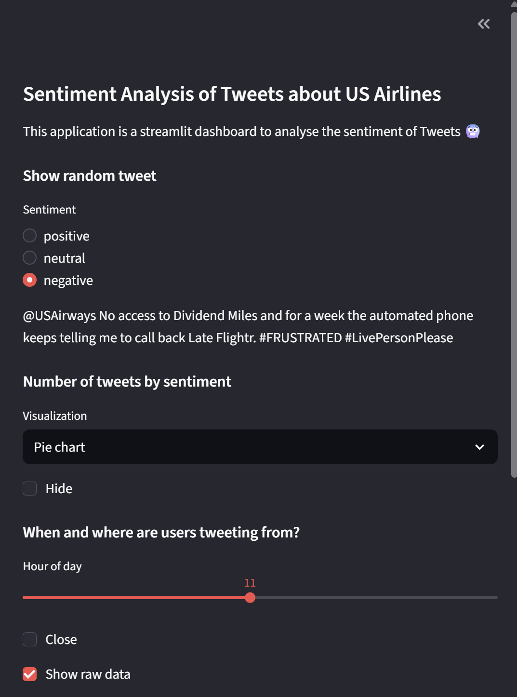
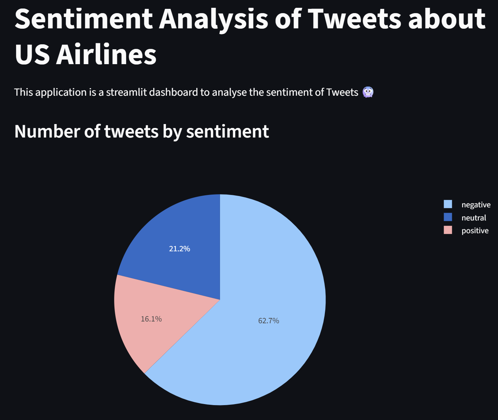
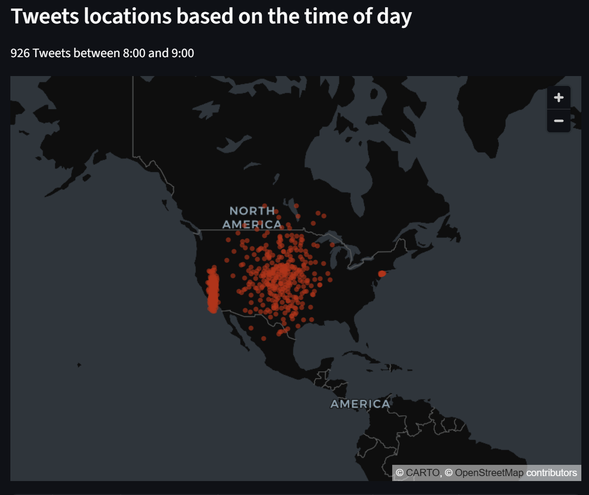
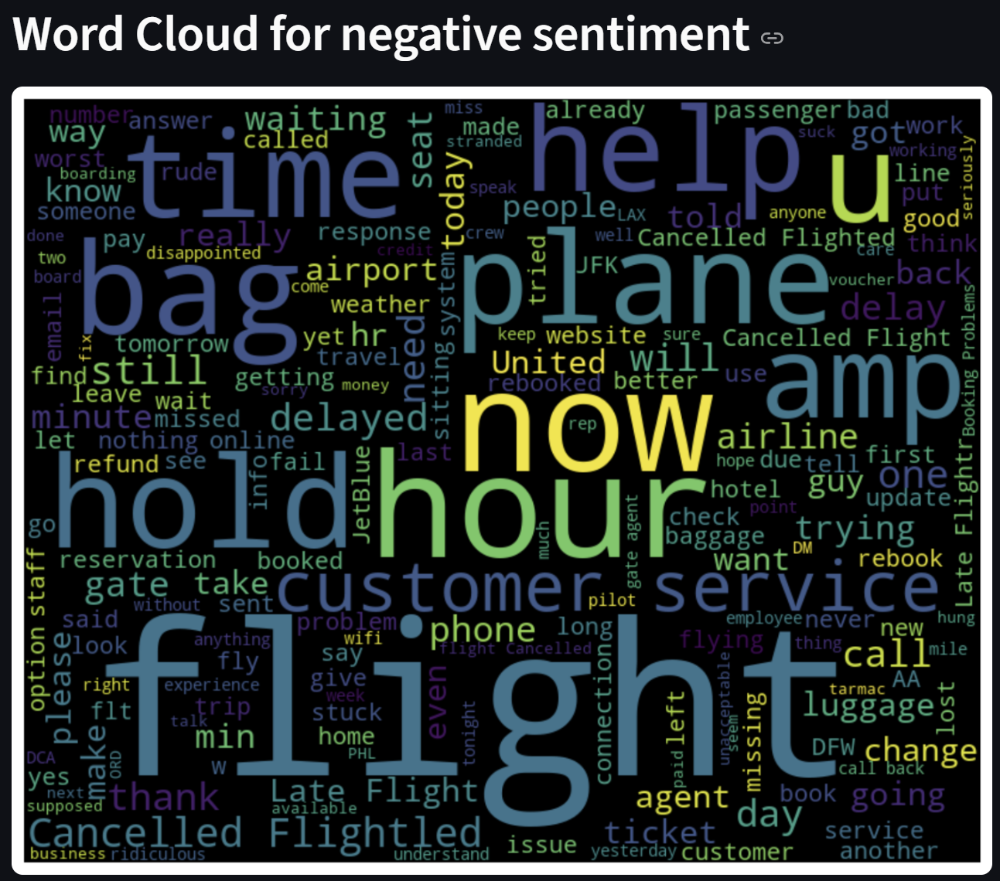

# Sentiment Analysis Dashboard with Streamlit

This project is a beginner Streamlit dashboard for analyzing tweet sentiment about US airlines.

I learned how to build this from a guided Coursera project:

**Create Interactive Dashboards with Streamlit and Python**  
https://www.coursera.org/projects/interactive-dashboards-streamlit-python

## Tech Stack
- Python
- Streamlit
- Pandas
- Plotly
- Matplotlib
- WordCloud

## Dataset
- Tweets.csv (US airline tweets sentiment dataset)

## Features
- Random tweet display by sentiment
- Sentiment distribution (Histogram / Pie chart)
- Tweet activity by hour with map view
- Airline sentiment breakdown (multiselect)
- Word cloud by selected sentiment

## Screenshots
Sidebar


Univariate Sentiment Chart


Map Visualization


Word Cloud


## Run the App
```bash
streamlit run app.py